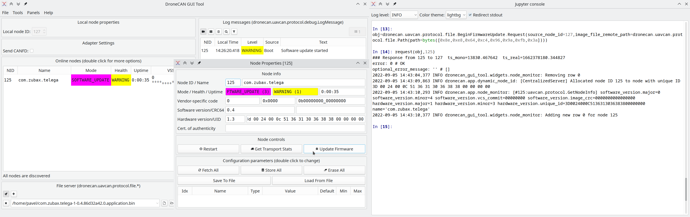

# Telega Bootloader v1.1 legacy regression workaround

This tool is designed to work around a regression in Telega Bootloader v1.1 shipped ca. 2022 Q2…Q3.
The problem is that the new bootloader can only be triggered to commence an application upgrade process
from the new Telega software v1.x, but not from the legacy version v0.x.
The reason is that the bootloader validates the CRC of the update request stored in the shared memory incorrectly,
thus ignoring it.
This results in the application simply restarting itself instead of launching the update process.
Note that this case **does not affect Telega v1.x software*, only its legacy version.

If you need to upgrade the firmware from Telega v1, you need not follow this guide.
If your nodes are equipped with a newer bootloader, you need not follow this guide.
Otherwise, build this application (or use a pre-built version provided to you earlier), then run the solver:

```
./solver 1000000 125 127 > out.bin
```

Where the arguments are:

- CAN bitrate \[bit/s], the default and the most commonly used case is 1000000.
- The node-ID of the node you wish to update the firmware on.
- The node-ID of the node serving the firmware file (if you are using a DroneCAN GUI Tool, this is usually 127).

The stdout of the solver should be redirected to a file because it will emit the shared data structure for diagnostics.
The stderr will contain the file name you should be using to commence the update process correctly.
For example, you may get this result:

```
8e,e8,64,c4,96,9a,fb,3a,00,00,00,00,00,00,00,00,00,00,00,00,00,00,00,00,00,00,00,00,00,00,00,00,00,00,00,00,00,00,00,00,00,00,00,00,00,00,00,00,00,00,00,00,00,00,00,00,00,00,00,00,00,00,00,00,00,00,00,00,00,00,00,00,00,00,00,00,00,00,00,00,00,00,00,00,00,00,00,00,00,00,00,00,00,00,00,00,00,00,00,00,00,00,00,00,00,00,00,00,00,00,00,00,00,00,00,00,00,00,00,00,00,00,00,00,00,00,00,00,00,00,00,00,00,00,00,00,00,00,00,00,00,00,00,00,00,00,00,00,00,00,00,00,00,00,00,00,00,00,00,00,00,00,00,00,00,00,00,00,00,00,00,00,00,00,00,00,00,00,00,00,00,00,00,00,00,00,00,00,00,00,00,00,00,00,00,00,00,00,00,00,00,
```

This string contains up to 8 bytes followed by zeros.
Now, you need to construct an update request using these arguments and send it to the node.
If you are using DroneCAN GUI Tool, open the Interactive Console, then type this
(optionally, you may omit the trailing zero bytes as they have no effect):

```python
obj = dronecan.uavcan.protocol.file.BeginFirmwareUpdate.Request(
    source_node_id=127,  # The ID of the node that serves the file; the same value you passed to the solver.
    image_file_remote_path=dronecan.uavcan.protocol.file.Path(path=bytes([0x8e,0xe8,0x64,0xc4,0x96,0x9a,0xfb,0x3a])),
)
request(obj,125)  # Send request to the target node (same value you gave to the solver).
```

You can also do this using a standalone Python script based on pydronecan,
or using any other implementation of DroneCAN.

Once you've done this, the node will launch the bootloader, but the update process will not actually commence,
and the bootloader will simply linger waiting for further instructions forever
(this is because the parameter structure it received from the application is misparsed).
The objective of the above exercise was to merely launch the bootloader,
now we have to launch the actual update process.
To do that, simply command the upgrade process following the standard procedure;
e.g., click the "Update Firmware" button in the DroneCAN GUI Tool.


